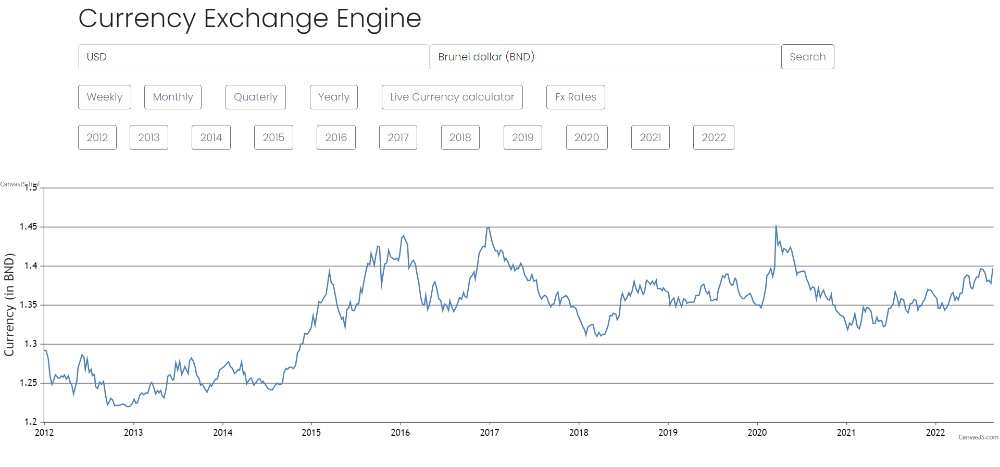
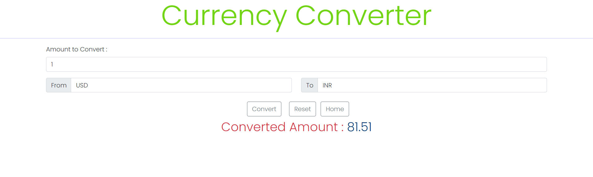
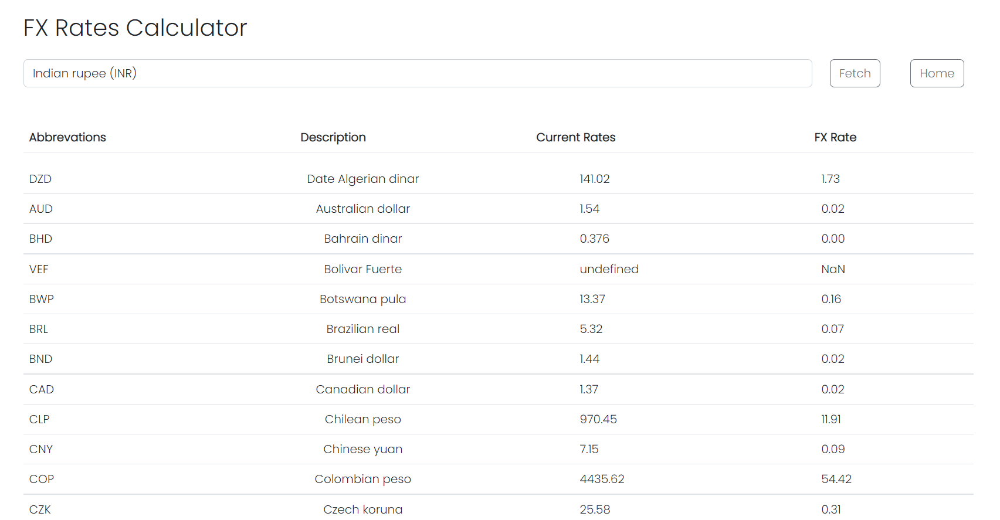

<!--
*** If you have a suggestion
*** that would make this better, please fork the repo and create a pull request
*** or simply open an issue with the tag "enhancement".
*** Thanks again! Now go create something AMAZING! :D
-->

 

  
  <h1 align="center">Currency Exchange Visulizer</h1>
  

<!--  -->

<!-- TABLE OF CONTENTS -->

  
Table of Contents

  <ol>
    <li>
      <a href="#about-the-project">About The Project</a>
      <ul>
        <li><a href="#built-with">Built With</a></li>
      </ul>
    </li>
    <li>
      <a href="#getting-started">Getting Started</a>
    </li>
    <li><a href="#Usage-of-currency-exchange-engine">Usage of currency Exchange Engine</a></li>
    <li><a href="#Usage-of-currency-exchange-engine">Usage of currency converter</a></li>
    <li><a href="#Usage-of-currency-exchange-engine">Usage of FxRate Calculator</a></li>
  </ol>

<!-- ABOUT THE PROJECT -->
## About The Project

Dashboard which will allow users to analyze the exchange rates between two currencies
over a period of time.
Users have the option to select weekly, monthly, quarterly, and yearly charts.
The dashboard also displays the date on which the rate was at its peak (highest) and
the date on which it was at its lowest.

### Some ScreenShots

### Built With

* [HTML](https://www.w3schools.com/html/)
* [CSS](https://www.w3schools.com/css/)
* [JavaScript](https://www.w3schools.com/js/)

<!-- GETTING STARTED -->
## Getting Started

Simply download to use the application.

<!-- USAGE EXAMPLES -->
## Usage of currency exchange engine
  <ul>
    <li>Step1: Open index.html in any browser</li>
    <li>Step2: Select 2 Currencies for visualization </li>
  <li>Step3: Click on Search Button (By Default weekly chart will be displayed) </li>
  <li>Step4: To Visualize monthly, quaterly and yearly charts click on repective buttons. </li>
</ul>

## Usage of currency converter
<ul>
  <li>Step1: Open index.html in any browser </li>
  <li>Step2: Click on Live Currency calculator Button </li>
  <li>Step3: Select "FROM" and "TO" currencies from dropdown </li>
  <li>Step4: Now Enter The Amount to convert. </li>
  <li>Step5: Click on convert button. </li>
</ul>

## Usage of fxRate Calculator
<ul>
  <li>Step1: Open index.html in any browser </li>
  <li>Step2: Click on FxRates Button </li>
  <li>Step3: Select any Currency and click on fetch button </li>
</ul>

## Contact
Vaibhav Paliwal - [@Vaibhav6200](https://github.com/Vaibhav6200)  
Kava Lakshit    - [@Lakshit21](https://github.com/Lakshit21)  
Vedant Modi     - [@vedant8689](https://github.com/vedant8689)  
Vedant Patel    - [@Kiraschild](https://github.com/Kiraschild)  
Nilanjan Vyas   - [@Nilanjan223](https://github.com/Nilanjan223)  
